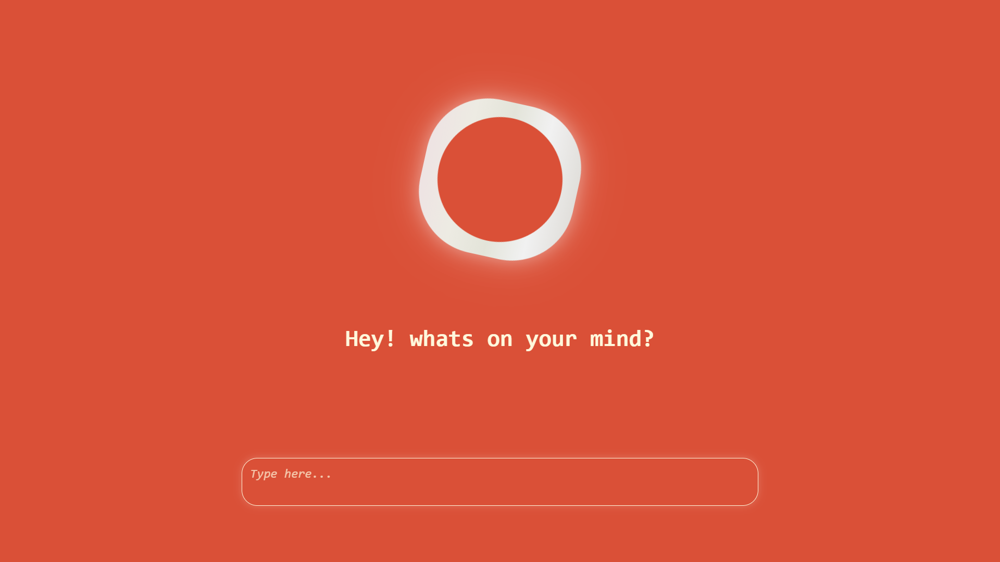

# AI Chatbot
A simple web-based AI chatbot powered by Microsoft's DialoGPT-small model from Hugging Face Transformers. Built with Flask, it provides a conversational interface with session-based chat history management.

Features

Conversational AI: Uses DialoGPT-small for generating human-like responses.
Session Management: Maintains chat history per browser session (up to 6 turns for efficiency).
Web Interface: Simple HTML-based chat UI (includes index.html and samanthaChat.html).
API Endpoints: RESTful API for chat interactions and history clearing.
GPU/CPU Support: Automatically detects and uses CUDA if available.
CORS Enabled: Allows cross-origin requests for frontend integration.

Tech Stack

Backend: Flask (Python web framework)
AI Model: DialoGPT-small (via Transformers library)
Deep Learning: PyTorch
Frontend: Basic HTML/JS (assumes index.html and samanthaChat.html for UI)

Installation

Clone the Repository:
textgit clone https://github.com/souhrudhJ/ai-chatbot.git
cd ai-chatbot

Create a Virtual Environment (recommended):
textpython -m venv venv
source venv/bin/activate  # On Windows: venv\Scripts\activate

Install Dependencies:
textpip install flask torch transformers

Note: For GPU support, ensure CUDA is installed and compatible with PyTorch.

Run the App:
textpython app.py

The server will start at http://127.0.0.1:5000.
Open your browser and navigate to http://127.0.0.1:5000 or http://127.0.0.1:5000/samanthaChat.html for the chat interface.

Usage
Web Interface

Visit the root URL (/) or /samanthaChat.html to access the chat UI.
Type a message and hit send—the bot will respond using the DialoGPT model.
Chat history is preserved within the session (via cookies).

API Endpoints

POST /api/chat:

Body: {"prompt": "Your message here"}
Response: {"response": "Bot's reply"}
Uses session cookie for history.

POST /api/clear_history:

Body: {"session_id": "optional_session_id"} (defaults to "default")
Response: {"ok": true}

Example API Call (using curl)
textcurl -X POST http://127.0.0.1:5000/api/chat \
  -H "Content-Type: application/json" \
  -d '{"prompt": "Hello, how are you?"}' \
  -c cookies.txt  # Saves session cookie
Configuration
Edit app.py for custom settings:

MODEL_NAME: Change to another DialoGPT variant (e.g., "microsoft/DialoGPT-medium").
MAX_NEW_TOKENS: Limit response length (default: 150).
MAX_HISTORY_TURNS: Cap history length (default: 6).
PORT / HOST: Adjust server binding.

Limitations

Model is small and may generate repetitive or off-topic responses.
No persistent storage—history is in-memory and per-session.
Requires ~500MB RAM (more on GPU).
Frontend files (index.html, samanthaChat.html) must be in the project root.

Troubleshooting

Model Loading Error: Ensure Transformers and PyTorch are up-to-date. If on CPU, responses may be slower.
CORS Issues: Already enabled for *—check browser console.
No GPU Detected: Install PyTorch with CUDA support: pip install torch --index-url https://download.pytorch.org/whl/cu118.

Contributing

Fork the repo.
Create a feature branch (git checkout -b feature/amazing-feature).
Commit changes (git commit -m 'Add amazing feature').
Push to the branch (git push origin feature/amazing-feature).
Open a Pull Request.

Feedback and PRs welcome!
License
This project is licensed under the MIT License - see the LICENSE file for details.

Built with ❤️ by Souhrudh. Questions? Open an issue!